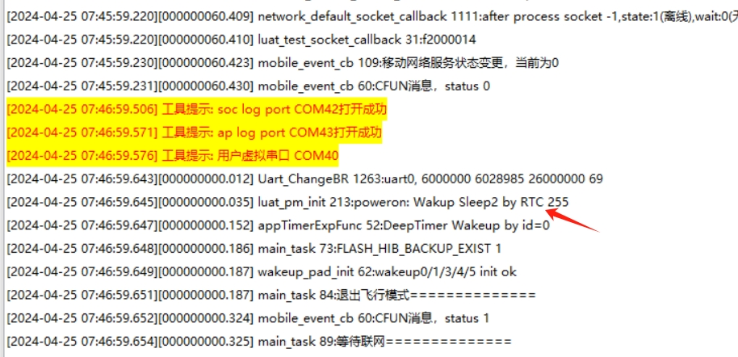
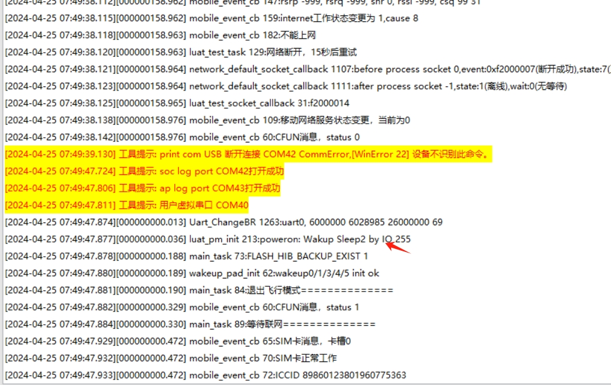

# 演示socket通信和休眠唤醒

## 功能介绍

1. TCP连接到目标服务器, 并等到数据下发
2. 收到服务器下发数据后5秒, 进入休眠模式, 3uA电流
3. 1分钟后定时器唤醒
4. WAKEUP0/WAKEUP1/WAKEUP4 下拉唤醒
5. 唤醒后退出飞行模式, 重新联网, 重复1

## 硬件连接

1. 本示例使用core开发板或者全开发板均可测试
2. 没有外部接线
3. 本代码在Air780ET/Air780EP验证可用, 其他模块理论上也支持

## 代码说明

1. WAKEUP脚是弱上拉的, 双向触发, 建议做外部防抖
2. 进入休眠模式后, 3uA电流, 不支持远程唤醒, 但core开发板是肯定做不到的,有其他元器件耗电
3. 进入休眠模式后, 唤醒后, 要退出飞行模式才能联网
4. mobile回调的"luat_mobile_cell_info_t cell_info"要放到函数外, 否则会栈内存会溢出
5. 代码里的服务器IP和端口号肯定已过期, 要到 [netlab.luatos.com](https://netlab.luatos.com) 点击 "打开TCP" 获取一个新的端口号, 并修改 "task_socket.c" 中的端口号

## 运行效果

RTC即dtimer定时器唤醒效果

WAKEUP0/WAKEUP1/WAKEUP4 唤醒效果

提醒:

1. 实际只有定时器唤醒, 使用日历方式唤醒是不支持的, 需要自行计算时长
2. 只有WAKEUP系列引脚是可以唤醒的, 普通GPIO不支持
